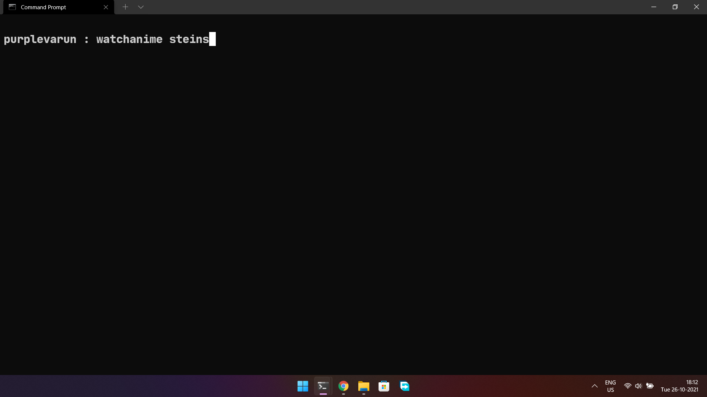
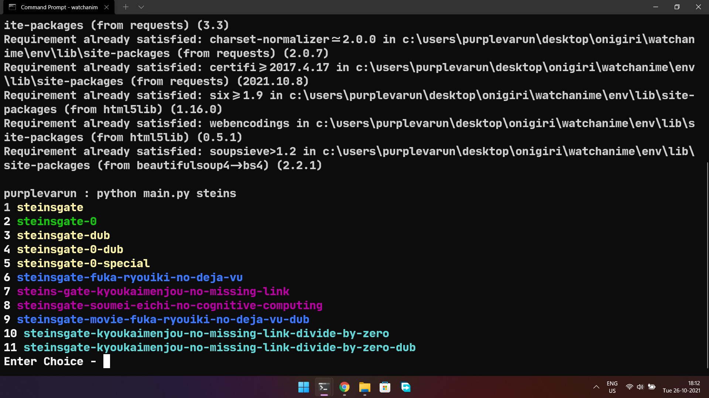
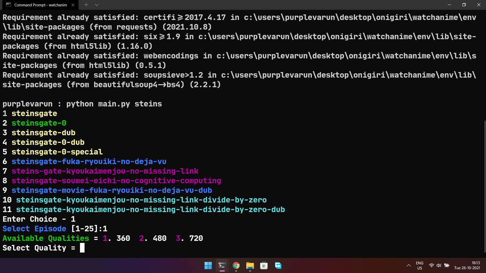
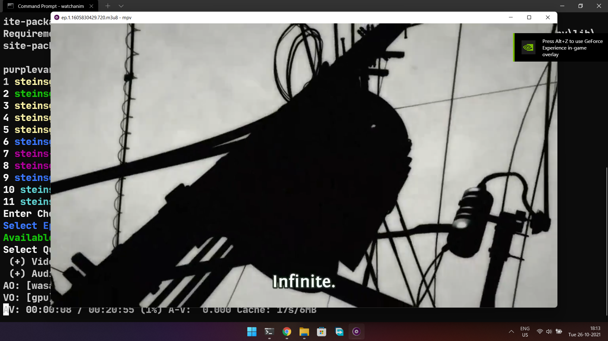

# Watch Anime from Terminal

## Lightweight Anime Streaming App for Windows

## ScreenShots

## Requirements

    1> Python for windows (with pip)
    2> 20 Mb data for installation

    To check if you have python and pip use :
    python --version
    pip --version

    If you do not have these, download from https://www.python.org/

## How To Install/Start:

    1>Download or Clone the repository

    2>Extract mpv.7z in the SAME Folder

(After extraction, your folder structure should look like <a href="imgs/s5.png">this</a>)

    3>Open CMD or Windows Terminal(recommended) in this directory

    4>Now just type the command below to watch anime

    5>watchanime [name of the anime]

    Example: watchanime attack of titan

### Made by Varun Kedia

### For Linux / Other OS, you can use ani-cli from pystardust.
